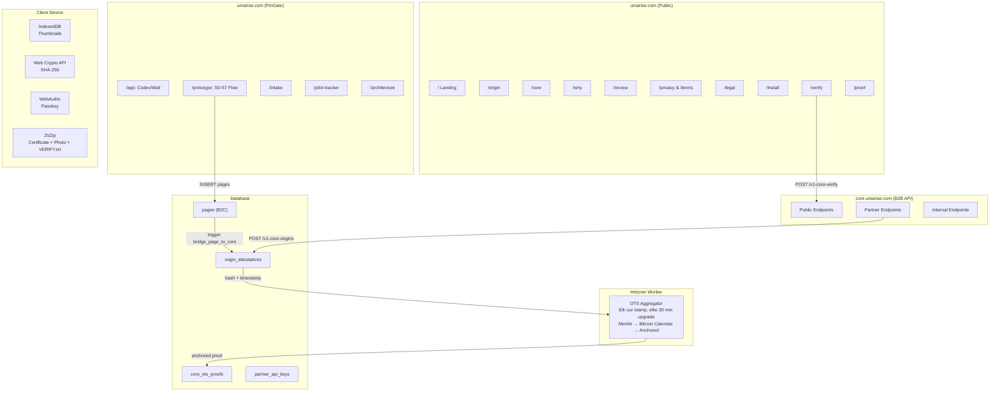
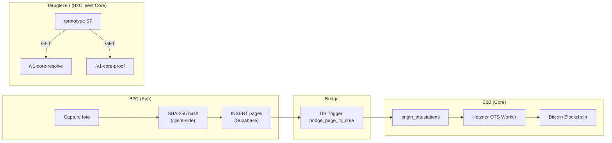
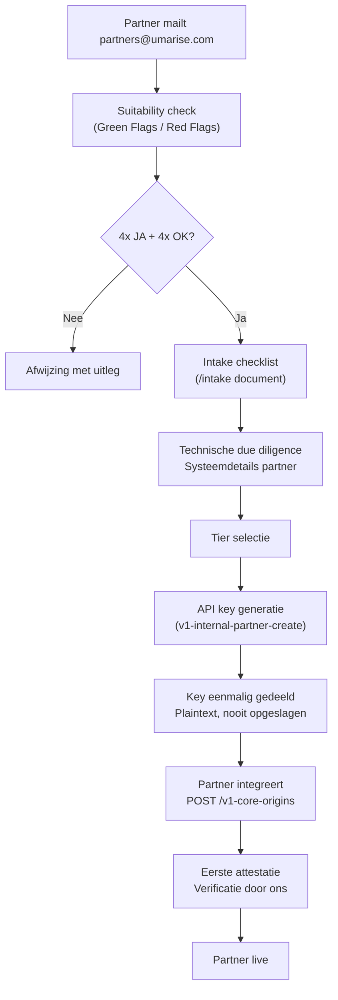

# Umarise: Architectuuroverzicht (9 feb 2026)



---

### 1. B2C App-laag (`/prototype`, Consument)

| Onderdeel | Status | Waar |
|-----------|--------|------|
| **device_user_id** | ✅ Auto-generated UUID | LocalStorage — anonieme device-identiteit, nooit gedeeld met Core |
| **S0 Welcome** | ✅ Live | Browser UI |
| **S1 Capture** | ✅ Camera + Photo Library | Device → Web Crypto |
| **S2 Pause** | ✅ Visuele bevestiging | Browser UI |
| **S3 Mark** | ✅ SHA-256 hashing + hold-to-mark | Client-side → `pages` INSERT |
| **S4 Sealed** | ✅ Museum label + artifact + file list | Browser UI |
| **S5 ZIP** | ✅ Live (photo + certificate + VERIFY.txt + proof.ots) | Client-side JSZip |
| **S6 Owned** | ✅ Auto-advance na save | Browser UI → Wall |
| **S7 Wall of Existence** | ✅ Horizontal gallery + detail modal | Client + `/v1-core-resolve` |
| **Passkey** | ✅ Live | Client-side WebAuthn |
| **IndexedDB thumbnails** | ✅ Live | Lokaal op device |
| **OTS status polling** | ✅ Live | `/v1-core-resolve` + `/v1-core-proof` via `useProofPolling` |

**Consumer-only features** (raken Core NIET):
- Passkey/WebAuthn ceremony → `claimed_by` + `signature` in certificate.json
- Thumbnails in IndexedDB
- ZIP generatie met photo + certificate + VERIFY.txt
- Alle UI/UX schermen (Museum Aesthetic design system)

---

### 2. B2B Core-laag (`core.umarise.com`, Partners)

#### Public Endpoints (geen API key)

| # | Method | Endpoint | Functie |
|---|--------|----------|---------|
| 1 | `GET` | `/v1-core-resolve` | Origin opzoeken (by ID of hash) |
| 2 | `POST` | `/v1-core-verify` | Hash verificatie (match/no-match) |
| 3 | `GET` | `/v1-core-proof` | Raw `.ots` binary download |
| 4 | `GET` | `/v1-core-health` | `{"status":"operational","version":"v1"}` |

#### Partner Endpoints (API key vereist)

| # | Method | Endpoint | Functie |
|---|--------|----------|---------|
| 5 | `POST` | `/v1-core-origins` | Origin attestatie aanmaken |
| 6 | `GET` | `/v1-core-origins-proof` | Proof data (JSON, base64) |
| 7 | `GET` | `/v1-core-proofs-export` | Bulk export (cursor-based) |

#### Internal Endpoints (intern secret)

| # | Method | Endpoint | Functie |
|---|--------|----------|---------|
| 8 | `POST` | `/v1-internal-partner-create` | API key generatie |
| 9 | `GET` | `/v1-internal-metrics` | 24h operationele metrics |

**Core v1 status:** Technisch bevroren (6 feb 2026). Geen nieuwe features. Alleen bugfixes en security hardening.

---

### 3. Waar B2C en B2B elkaar raken



**De enige contactpunten:**

| Richting | Mechanisme | Wat |
|----------|-----------|-----|
| **B2C → Core** | DB trigger `bridge_page_to_core` | Hash + timestamp propagatie naar `origin_attestations` |
| **Core Worker → DB** | Hetzner OTS Worker schrijft naar `core_ots_proofs` | Status update (pending→anchored) rechtstreeks in de database |
| **DB → B2C (best-effort)** | Supabase Edge Function `notify-ots-complete` | Wordt getriggerd door DB-event, niet door Core zelf. Best-effort in try/catch — de App pollt ook zelfstandig via `useProofPolling` |
| **B2C leest Core** | `GET /v1-core-resolve` | Status ophalen (pending/anchored) |
| **B2C leest Core** | `GET /v1-core-proof` | Raw `.ots` binary voor ZIP |

**Wat er NIET over de grens gaat:**
- Foto bytes (nooit)
- Thumbnails (lokaal)
- Passkey credentials (Auth, niet Core)
- UI labels, schermnamen (App-domein)
- `device_user_id` (Core is identity-agnostic)

---

### 4. Verify Discovery Path (nieuw: 9 feb)

Vier technische contactpunten die verkeer naar `/verify` leiden:

| # | Contactpunt | Waar | Mechanisme |
|---|-------------|------|------------|
| 1 | **VERIFY.txt** | In elke ZIP | Origin ID, timestamp, hash, directe verificatielink |
| 2 | **verify_url** | In certificate.json | `https://umarise.com/verify` (canoniek) |
| 3 | **Verifieer-link** | Sealed screen (S4) | Subtiele link onder save-button |
| 4 | **Deel origin** | Wall detail modal (S7) | Web Share API → ZIP / clipboard fallback |

---

### 5. Origin Mark Visueel Systeem (nieuw: 9 feb)

De circumpunct (⊙) als universeel brand- en statussymbool:

| Context | Formaat | State | Variant |
|---------|---------|-------|---------|
| **S0 Welcome** | 72px | anchored | dark, heartbeat animatie |
| **S1 Capture** | 48px | anchored | dark, breathing animatie |
| **S4 Sealed** | 48px | anchored | dark, glow |
| **Wall status** | 20px | anchored/pending | dark |
| **Navigation** | 28px | anchored | dark |
| **Site header** | 16px | anchored | dark (alle pagina's) |
| **/verify upload zone** | 48px | ghost | dark (lege ring) |
| **/verify resultaat** | 28px | anchored | dark, glow |
| **/core partner endpoints** | 12px | pending | dark (gestreepeld) |
| **/review properties** | 12px | anchored | dark |

---

### 6. `/verify`: Onafhankelijk Verificatie-instrument

| Eigenschap | Waarde |
|-----------|--------|
| **Route** | `/verify` (publiek, geen PinGate) |
| **Architectuur** | Geïsoleerd van App-laag |
| **Dependencies** | Geen Auth, geen IndexedDB, geen `pages` tabel |
| **Hashing** | Client-side Web Crypto API |
| **ZIP extractie** | Client-side JSZip |
| **API calls** | `POST /v1-core-verify` (publiek) |
| **Privacy** | Bestanden verlaten device NIET |
| **Origin Mark** | Ghost (upload) → Anchored+glow (resultaat) |

---

### 7. Database Integriteit

| Tabel | Bescherming | Doel |
|-------|-------------|------|
| `origin_attestations` | `prevent_origin_attestation_update` + `prevent_origin_attestation_delete` | Write-once, append-only |
| `core_ots_proofs` | `prevent_anchored_proof_mutation` + delete-trigger | Bewijs onwijzigbaar na anchoring |
| `partner_api_keys` | `prevent_api_key_delete` | Keys niet verwijderbaar |
| `core_ddl_audit` | DDL event trigger | Schema-wijzigingen gelogd |

---

### 8. Publieke Documentatie-routes

| Route | Doel | Doelgroep | Origin Mark |
|-------|------|-----------|-------------|
| `/` | Landing / infrastructuur positionering | Iedereen | 16px header |
| `/origin` | Wat is een origin? | Prospects | 16px header |
| `/core` | Core API spec | Technisch | 16px header + 12px inline |
| `/why` | Waarom origins? | Business | 16px header |
| `/review` | Technical Review Kit | CTOs / integrators | 16px header + 12px inline |
| `/proof` | Proof uitleg | Algemeen | 16px header |
| `/verify` | Verificatie tool | Iedereen | 16px header + 48px/28px |
| `/legal` | Juridisch kader | Juridisch | 16px header |
| `/privacy` + `/terms` | Privacy en voorwaarden | Compliance | 16px header |
| `/install` | PWA installatie | Consumenten | 16px header |

---

### 9. Partner Onboarding Flow



**Kernprincipes:** Geen self-service. Elke partner wordt handmatig gekwalificeerd. Key is eenmalig. Write-once en hash-only.

---

### 10. ZIP Artifact Compositie

Elke origin produceert een zelfstandig bewijspakket:

| Bestand | Altijd aanwezig | Inhoud |
|---------|----------------|--------|
| `photo.jpg/png` | Nee (alleen als foto beschikbaar) | Origineel artifact |
| `certificate.json` | ✅ Ja | Origin ID, hash, timestamp, claimed_by, verify_url |
| `VERIFY.txt` | ✅ Ja | Menselijk leesbare verificatie-instructies + link |
| `proof.ots` | Nee (alleen bij anchored status) | OpenTimestamps binary bewijs |

---

### 11. Samenvatting

```
+-----------------------------------------------------+
|                  umarise.com                         |
|                                                      |
|  Publiek:  / /origin /core /why /verify /review ...  |
|  PinGate:  /app /prototype /intake /pilot-tracker    |
|            /architecture                              |
|                                                      |
|  Visueel:  Origin Mark (⊙) op alle headers (16px)   |
|            Ghost/pending/anchored states per context  |
|                                                      |
+-----------------------------------------------------+
|               core.umarise.com                       |
|                                                      |
|  Publiek:    resolve, verify, proof, health           |
|  Partner:    origins, origins-proof, proofs-export    |
|  Intern:     partner-create, metrics                  |
|  Status:     v1 bevroren (6 feb 2026)                |
|                                                      |
+-----------------------------------------------------+
|                  Hetzner                              |
|                                                      |
|  OTS Worker:  Merkle aggregation → Bitcoin            |
|  (Node.js, onafhankelijk van Supabase)               |
|                                                      |
+-----------------------------------------------------+
|              Client Device                           |
|                                                      |
|  IndexedDB, Web Crypto, WebAuthn, JSZip              |
|  Geen data verlaat het device zonder expliciete actie |
|  ZIP = photo + certificate.json + VERIFY.txt + .ots  |
+-----------------------------------------------------+
```

**Kernfeit:** Core weet niet dat de App bestaat. De App weet dat Core bestaat. De grens is schoon.

**Vandaag toegevoegd (9 feb):**
- Verify Discovery Path (4 contactpunten: VERIFY.txt, certificate verify_url, Sealed link, Wall deel-knop)
- Origin Mark visueel systeem op alle site-pagina's (16px header, ghost/pending/anchored states)
- ZIP bevat nu VERIFY.txt met menselijk leesbare verificatie-instructies
