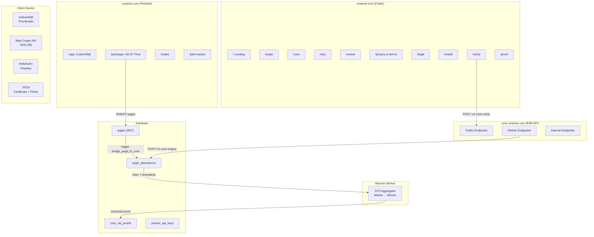
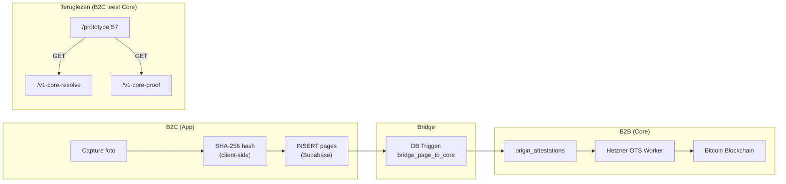
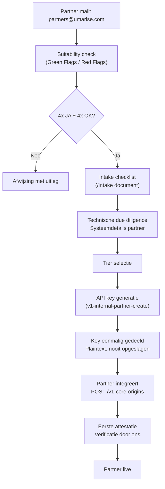

# Umarise: Architectuuroverzicht (8 feb 2026)



---

### 1. B2C App-laag (`/prototype`, Consument)

| Onderdeel | Status | Waar |
|-----------|--------|------|
| **S0 Welcome** | ✅ Live | Browser UI |
| **S1 Capture** | ✅ Camera + Photo Library | Device → Web Crypto |
| **S2 Pause** | ✅ Visuele bevestiging | Browser UI |
| **S3 Mark** | ✅ SHA-256 hashing | Client-side → `pages` INSERT |
| **S4 Release** | ✅ Origin ID + status | Browser UI |
| **S5 ZIP** | ✅ Live | Client-side JSZip |
| **S6 Owned** | ✅ Live (Wall) | Browser UI |
| **S7 Marked Origins** | ✅ Live | Client + `/v1-core-resolve` |
| **Passkey** | ✅ Live | Client-side WebAuthn |
| **IndexedDB thumbnails** | ✅ Live | Lokaal op device |
| **OTS status polling** | ✅ Live | `/v1-core-resolve` + `/v1-core-proof` via `useProofPolling` |

**Consumer-only features** (raken Core NIET):
- Passkey/WebAuthn ceremony → `claimed_by` + `signature` in certificate.json
- Thumbnails in IndexedDB
- ZIP generatie met photo + certificate
- Alle UI/UX schermen

---

### 2. B2B Core-laag (`core.umarise.com`, Partners)

#### Public Endpoints (geen API key)

| # | Method | Endpoint | Functie |
|---|--------|----------|---------|
| 1 | `GET` | `/v1-core-resolve` | Origin opzoeken (by ID of hash) |
| 2 | `POST` | `/v1-core-verify` | Hash verificatie (match/no-match) |
| 3 | `GET` | `/v1-core-proof` | Raw `.ots` binary download |
| 4 | `GET` | `/v1-core-health` | `{"status":"operational","version":"v1"}` |

#### Partner Endpoints (API key vereist)

| # | Method | Endpoint | Functie |
|---|--------|----------|---------|
| 5 | `POST` | `/v1-core-origins` | Origin attestatie aanmaken |
| 6 | `GET` | `/v1-core-origins-proof` | Proof data (JSON, base64) |
| 7 | `GET` | `/v1-core-proofs-export` | Bulk export (cursor-based) |

#### Internal Endpoints (intern secret)

| # | Method | Endpoint | Functie |
|---|--------|----------|---------|
| 8 | `POST` | `/v1-internal-partner-create` | API key generatie |
| 9 | `GET` | `/v1-internal-metrics` | 24h operationele metrics |

---

### 3. Waar B2C en B2B elkaar raken



**De enige contactpunten:**

| Richting | Mechanisme | Wat |
|----------|-----------|-----|
| **B2C → Core** | DB trigger `bridge_page_to_core` | Hash + timestamp propagatie naar `origin_attestations` |
| **Core → B2C** | Async notification `notify-ots-complete` | Best-effort, in try/catch (geen hard dependency) |
| **B2C leest Core** | `GET /v1-core-resolve` | Status ophalen (pending/anchored) |
| **B2C leest Core** | `GET /v1-core-proof` | Raw `.ots` binary voor ZIP |

**Wat er NIET over de grens gaat:**
- Foto bytes (nooit)
- Thumbnails (lokaal)
- Passkey credentials (Supabase Auth, niet Core)
- UI labels, schermnamen (App-domein)
- `device_user_id` (Core is identity-agnostic)

---

### 4. `/verify`: Onafhankelijk Verificatie-instrument

| Eigenschap | Waarde |
|-----------|--------|
| **Route** | `/verify` (publiek, geen PinGate) |
| **Architectuur** | Gesoleerd van App-laag |
| **Dependencies** | Geen Auth, geen IndexedDB, geen `pages` tabel |
| **Hashing** | Client-side Web Crypto API |
| **ZIP extractie** | Client-side JSZip |
| **API calls** | `POST /v1-core-verify` (publiek) |
| **Privacy** | Bestanden verlaten device NIET |

---

### 5. Database Integriteit

| Tabel | Bescherming | Doel |
|-------|-------------|------|
| `origin_attestations` | `prevent_origin_attestation_update` + `prevent_origin_attestation_delete` | Write-once, append-only |
| `core_ots_proofs` | `prevent_anchored_proof_mutation` + delete-trigger | Bewijs onwijzigbaar na anchoring |
| `partner_api_keys` | `prevent_api_key_delete` | Keys niet verwijderbaar |
| `core_ddl_audit` | DDL event trigger | Schema-wijzigingen gelogd |

---

### 6. Publieke Documentatie-routes

| Route | Doel | Doelgroep |
|-------|------|-----------|
| `/` | Landing / infrastructuur positionering | Iedereen |
| `/origin` | Wat is een origin? | Prospects |
| `/core` | Core API spec | Technisch |
| `/why` | Waarom origins? | Business |
| `/review` | Technical Review Kit | CTOs / integrators |
| `/proof` | Proof uitleg | Algemeen |
| `/verify` | Verificatie tool | Iedereen |
| `/legal` | Juridisch kader | Juridisch |
| `/privacy` + `/terms` | Privacy en voorwaarden | Compliance |
| `/install` | PWA installatie | Consumenten |

---

### 7. Partner Onboarding Flow



| # | Stap | Wie | Wat |
|---|------|-----|-----|
| 1 | Eerste contact | Partner | Mailt `partners@umarise.com` met use case |
| 2 | Suitability check | Umarise | Green flags: hoge frequentie data, regulatory druk, audit needs. Red flags: wil records verwijderen, zoekt content management |
| 3 | Kwalificatie | Umarise | 4x JA + 4x OK framework. Past dit bij een write-once registry? |
| 4 | Intake | Partner | Vult systeemdetails in (intern `/intake` checklist) |
| 5 | Due diligence | Umarise | Technische evaluatie: welke artifacts, hashing capability, volume |
| 6 | Tier selectie | Samen | Op basis van volume en use case |
| 7 | API key generatie | Umarise | Via `v1-internal-partner-create`, 64-char hex key |
| 8 | Key overdracht | Umarise → Partner | Plaintext key eenmalig gedeeld, daarna nooit meer opvraagbaar |
| 9 | Integratie | Partner | `POST /v1-core-origins` met `X-API-Key` header |
| 10 | Verificatie | Samen | Eerste attestatie testen, resolve en proof checken |
| 11 | Live | Partner | Productie-traffic start |

**Kernprincipes:** Geen self-service. Elke partner wordt handmatig gekwalificeerd. Key is eenmalig. Write-once en hash-only.

---

### 8. Samenvatting

```
+-----------------------------------------------------+
|                  umarise.com                         |
|                                                      |
|  Publiek:  / /origin /core /why /verify /review ...  |
|  PinGate:  /app /prototype /intake /pilot-tracker    |
|                                                      |
+-----------------------------------------------------+
|               core.umarise.com                       |
|                                                      |
|  Publiek:    resolve, verify, proof, health           |
|  Partner:    origins, origins-proof, proofs-export    |
|  Intern:     partner-create, metrics                  |
|                                                      |
+-----------------------------------------------------+
|                  Hetzner                              |
|                                                      |
|  OTS Worker:  Merkle aggregation → Bitcoin            |
|  (Node.js, onafhankelijk van Supabase)               |
|                                                      |
+-----------------------------------------------------+
|              Client Device                           |
|                                                      |
|  IndexedDB, Web Crypto, WebAuthn, JSZip              |
|  Geen data verlaat het device zonder expliciete actie |
+-----------------------------------------------------+
```

**Kernfeit:** Core weet niet dat de App bestaat. De App weet dat Core bestaat. De grens is schoon.
