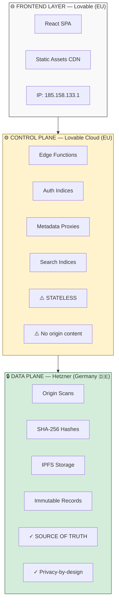
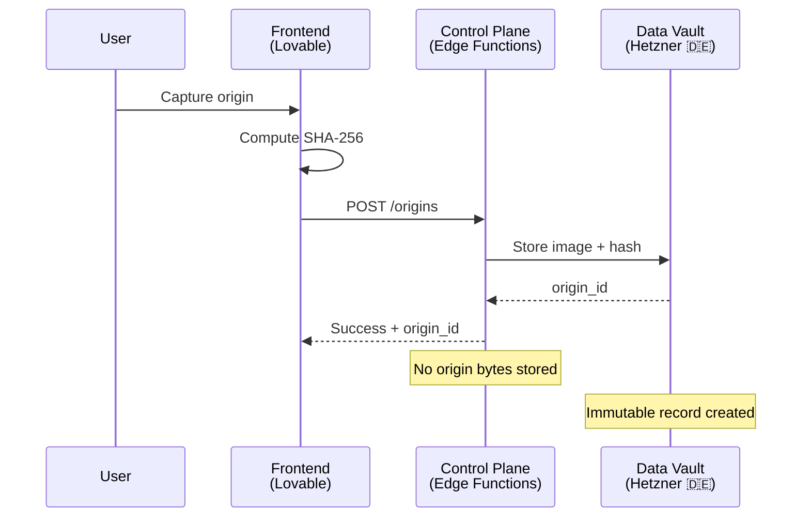
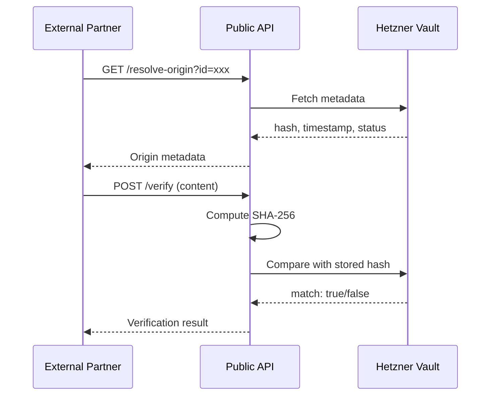

# Infrastructure Overview

**Last updated**: January 29, 2026  
**Status**: Production

---

## DNS Configuration

| Domain | Record Type | Value | Provider |
|--------|-------------|-------|----------|
| `umarise.com` | A | 185.158.133.1 | Lovable |
| `www.umarise.com` | A | 185.158.133.1 | Lovable |
| `_lovable.umarise.com` | TXT | lovable_verify=... | Ownership verification |
| `umarise.lovable.app` | CNAME | Lovable CDN | Lovable (staging) |

**SSL**: Automatically provisioned via Let's Encrypt

---

## Three-Layer Architecture

### Visual Diagram



### Data Flow



### Verification Flow



### ASCII Fallback

```
┌─────────────────────────────────────────────────────────────┐
│                      FRONTEND LAYER                         │
│                         Lovable (EU)                        │
│                                                             │
│  • React SPA (Vite + TypeScript)                           │
│  • Static assets via CDN                                    │
│  • IP: 185.158.133.1                                       │
└─────────────────────────────────────────────────────────────┘
                              │
                              ▼
┌─────────────────────────────────────────────────────────────┐
│                    CONTROL PLANE LAYER                      │
│                    Lovable Cloud (EU)                       │
│                                                             │
│  • Edge Functions (Deno runtime)                           │
│  • Authentication indices                                   │
│  • Metadata proxies                                        │
│  • Search indices                                          │
│                                                             │
│  ⚠️  STATELESS — No origin content stored                  │
│  ⚠️  Cannot reconstruct origin data                        │
└─────────────────────────────────────────────────────────────┘
                              │
                              ▼
┌─────────────────────────────────────────────────────────────┐
│                     DATA PLANE LAYER                        │
│                    Hetzner (Germany 🇩🇪)                     │
│                                                             │
│  • Origin scans (source images)                            │
│  • SHA-256 cryptographic hashes                            │
│  • IPFS content-addressed storage                          │
│  • Immutable records (write-once)                          │
│                                                             │
│  ✓ SOURCE OF TRUTH                                         │
│  ✓ Privacy-by-design at data level                         │
└─────────────────────────────────────────────────────────────┘
```

---

## Privacy Architecture

### Core Invariant

> **"Compromise of Lovable/Supabase (control plane) must never yield origin content."**

### Intentional Separation

| Layer | Privacy Role | Compromise Impact |
|-------|--------------|-------------------|
| **Hetzner (Data)** | Truth storage | Would expose origins |
| **Lovable Cloud (Control)** | Stateless proxy | Degrades convenience, not truth |

### Design Principles

1. **Privacy sits where it MUST** — at the data layer (Hetzner)
2. **Operational flexibility where it CAN** — at the control plane
3. **Zero reconstruction capability** — control plane cannot rebuild origin content
4. **Egress allowlist** — Edge Functions only communicate with Hetzner

---

## Security Layers

### 1. Device-Based Isolation

- **Identifier**: 128-bit UUID (`device_user_id`)
- **Storage**: Browser localStorage
- **Entropy**: 2^122 (cryptographically secure)
- **Philosophy**: Zero-account, privacy-first

### 2. Header Validation

All Edge Function requests require:

```
x-device-id: [36-character UUID]
```

Validation rules:
- Exactly 36 characters
- Alphanumeric with hyphens
- Regex: `/^[a-z0-9-]+$/`

### 3. Row-Level Security (RLS)

All database tables enforce:
- `device_user_id` column matching request header
- No cross-device data access

### 4. Immutability Enforcement

- Database triggers prevent modification of origin records
- SHA-256 hashes computed client-side before upload
- Write-once semantics on Hetzner storage

---

## Performance Optimizations

### IPFS Image Retrieval

| Optimization | Implementation |
|--------------|----------------|
| Authenticated proxy | `GET /vault/ipfs/proxy` via HETZNER_API_TOKEN |
| Client-side cache | In-memory blob URLs (30-min TTL, 100-image limit) |
| Parallel preloading | Views prefetch visible images |
| Persistent blob URLs | Not revoked on unmount for instant re-render |

---

## API Endpoints

### Public (No Authentication)

| Endpoint | Method | Purpose |
|----------|--------|---------|
| `/resolve-origin` | GET | Origin metadata lookup |
| `/verify` | POST | Bit-identity verification |

### Protected (API Key)

| Endpoint | Method | Purpose |
|----------|--------|---------|
| `/origins` | POST | Create new origin (write-once) |

---

## Jurisdiction Summary

| Component | Location | Provider | Data Stored |
|-----------|----------|----------|-------------|
| Frontend | EU | Lovable | None (static) |
| Control Plane | EU | Lovable Cloud | Indices, metadata |
| Data Plane | 🇩🇪 Germany | Hetzner | Origin content |

---

## Phase 2 Invariants

1. Control plane stores no origin payloads, encryption keys, or secrets
2. Hetzner is the sole source-of-truth for origin content
3. Verifiability never depends on Supabase availability
4. Control-plane compromise degrades convenience, not truth
5. Edge Function egress allowlisted to Hetzner only
6. Logs contain no payloads, tokens, or PII
7. Partners can operate Vault-only (without control plane)

---

## Related Documentation

- [`integration-contract.md`](./integration-contract.md) — API primitives
- [`layer-boundaries.md`](./layer-boundaries.md) — System boundaries
- [`cto-technical-factsheet.md`](./cto-technical-factsheet.md) — Due diligence baseline
- [`phase-2-roadmap.md`](./phase-2-roadmap.md) — Architecture evolution
